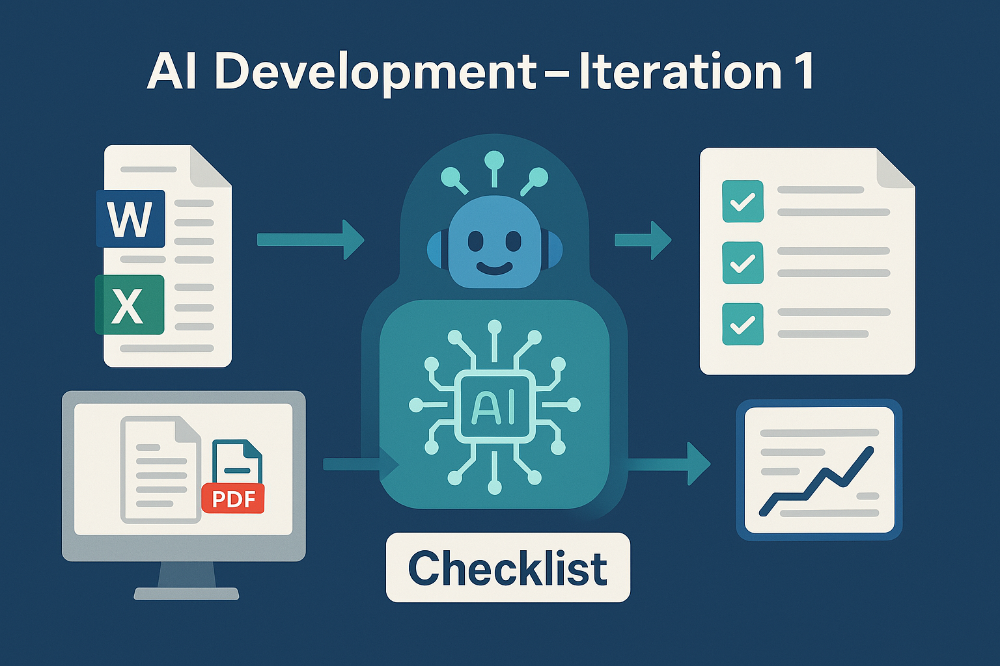

# AI Development - Iteration 1

This project is the first iteration to an exciting journey into the world of AI development. It's an exercise designed to sharpen my skills in translating user requirements into functional code using AI assistance, while simultaneously exploring the power of building sophisticated, stateful agents with LangGraph.

## Project Scope

The primary goal is to create an intelligent agent capable of analyzing project documentation (Word, Excel, PDF) to assess its completeness against a predefined checklist. This agent will:

1. **Ingest & Index:** Parse and process various document formats, chunking the text and creating vector embeddings for efficient retrieval.
2. **Retrieve Relevant Information:** Query the indexed documents based on specific checklist items to find pertinent sections.
3. **Evaluate Compliance:** Utilize a Large Language Model (LLM) to determine if each checklist item is met (Yes/No/NA), providing reasoning, supporting evidence, and a confidence score.
4. **Handle Uncertainty:** Implement a mechanism for requesting human review when the agent's confidence is below a threshold.
5. **Calculate PDL:** Compute a final Project Definition Level (PDL) score based on the weighted results of the checklist evaluation.

## Architecture Overview

We're building a robust, modular system leveraging Python and the LangGraph framework:

* **Core Agent Logic (LangGraph):**
  * **State Management:** Tracks the conversation state, including documents, checks, results, and context.
  * **Graph Definition:** Defines the flow of the assessment process using LangGraph nodes (e.g., `index_documents`, `evaluate_check`, `calculate_pdl`) and edges.
  * **LLM Integration:** Interfaces with LLMs (configurable via `.env`) for the core evaluation tasks.
  * **Processing Module:** Orchestrates the steps within the LangGraph flow.
  * **Tool Integration:** Connects to necessary tools for document parsing (e.g., `python-docx`, `pypdf`), vector storage (e.g., `FAISS`), etc.

* **Backend Service (Flask/Flask-SocketIO):**
  * **API & WebSockets:** Provides RESTful endpoints and WebSocket connections for clients to interact with the agent, manage documents, and view results.
  * **Database:** Uses SQLAlchemy (with SQLite default, configurable via `.env`) to persist conversation state, user data, and results.
  * **Authentication:** Manages user sessions and secures endpoints (e.g., using JWT).
  * **Supporting Layers:** Includes modules for configuration (`.env`), logging, caching, and utility functions.

This architecture allows for a clear separation of concerns, facilitating development, testing, and future extensions.
